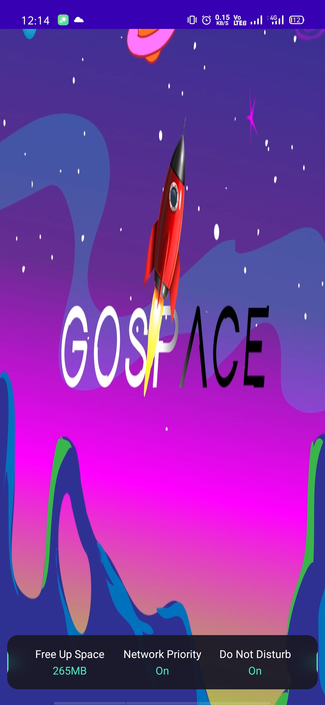
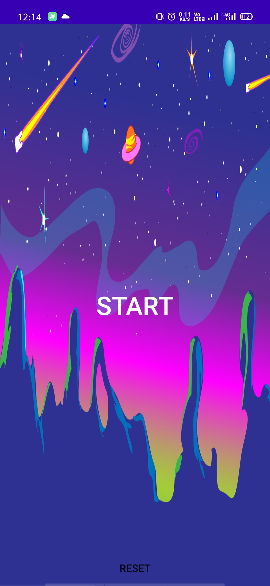
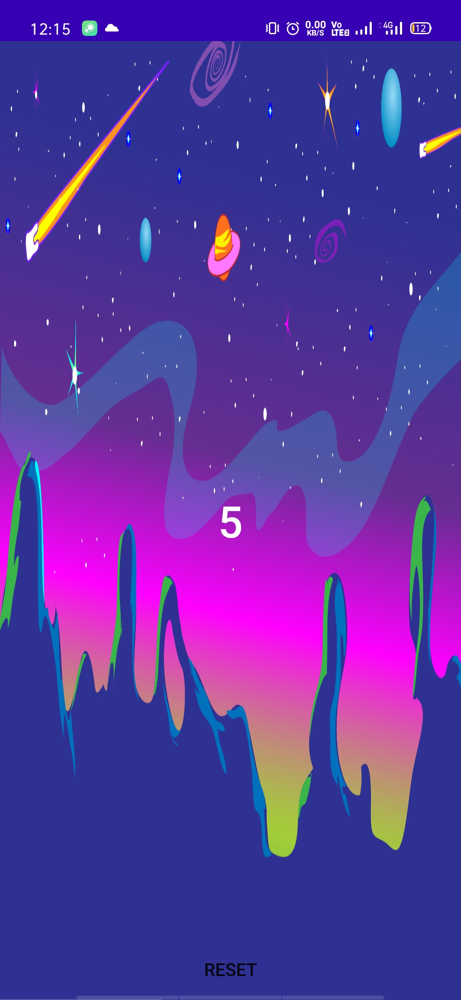
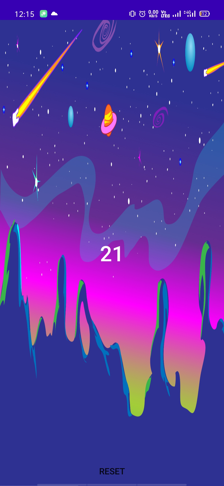

# GoSpace-beta
(Early-Access)

<h1>About</h1>
In this players have to throw their phone up and catch or simply shake the phone. More the phone reaches toward sky or more the shake is given by players to their phones more they will get score.
 
<h1>Starting Guide</h1>
1.Just simply download the .apk file from debug folder and copy inside the android phone.
2.Install the .apk file and give permissions if ask any.
3.After installing and you are good to go with game.
 
<h1>Screenshots</h1>

Welcome to your Game

<h3>Splashscreen</h3>

<h3>HomeScreen</h3>

 

Press start button

<h3>InGame</h3>

<h3>HighScore</h3>

Get your HighScore

 

 
<h1>Note</h1>
 

1.Be calm while throwing phone up and make you catch it safely

 
<b>ENJOY YOUR GAME</b>
 
<h3>Language of implementation</h3>
* Java
 
Developed by Jaspreet Singh
 
